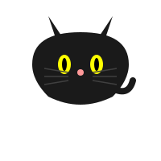
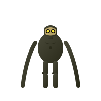

# Ghibli Animated SVG Icons
A collection of adorable animated SVG icons inspired by Studio Ghibli characters.

## Gallery

## Icons List
| Icon | Description |
|------|-------------|
| Totoro | A friendly forest spirit with animated ears and whiskers |
| Jiji | Kiki's talking black cat with blinking eyes |
| No Face | A mysterious spirit with flowing body animation |
| Calcifer | A lively fire demon with flickering flames and glowing effects |
| Garden Robot | A gentle guardian robot from Laputa with glowing eyes and long swaying arms |
| Soot Sprite | A bouncy Makkuro Kurosuke with blinking eyes and waving arms | 

---
💫 Drop a star if you like this project!

